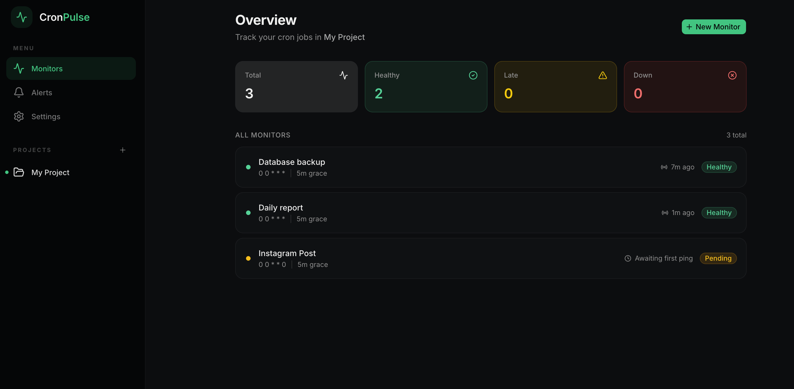
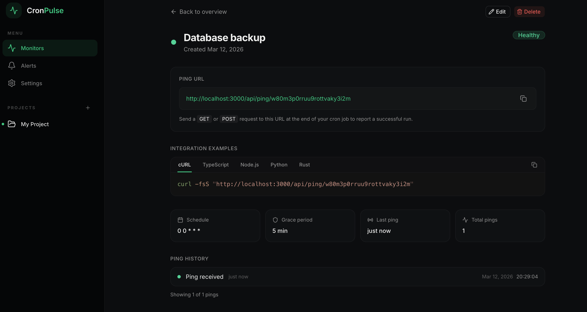

<p align="center">
  
  
  
</p>

<h1 align="center">CronPulse</h1>

<p align="center">
  <strong>The open source platform for cron jobs</strong><br/>
  Monitor your existing cron jobs and get alerted on Discord, Slack, Telegram, and email when something goes wrong.
</p>

---

<p align="center">
  
  
</p>

## How it works

1. **Register your job** — Add your cron job to CronPulse with its expected schedule
2. **Add a ping** — Hit your unique ping URL when the job runs successfully
3. **Get alerted** — If the ping doesn't arrive on time, CronPulse alerts you

```
https://<your-cronpulse-url>/ping/abc123
```

## Features

- **Real-time monitoring** — Track every cron job. See which are healthy, late, or down
- **Multi-channel alerts** — Discord, Slack, Telegram, email, and custom webhooks
- **Zero config** — No SDK, no agent. Just add a curl to your script
- **Self-hostable** — Run on your own infrastructure with Docker
- **Alert history** — Full audit trail of every alert sent
- **Email + password auth** — Sign up immediately, no OAuth setup required
- **GitHub OAuth** — Optional, for teams that prefer it

## Quick start (Docker)

### Prerequisites

- [Docker](https://docs.docker.com/get-docker/) and Docker Compose installed
- (Optional) A [GitHub OAuth app](https://github.com/settings/developers) for GitHub sign-in

### 1. Clone the repository

```bash
git clone https://github.com/AneeshaRama/cronpulse.git
cd cronpulse
```

### 2. Configure environment

```bash
cp .env.example .env
```

Open `.env` and update the following:

```bash
# Generate a secret (required)
# Run: openssl rand -base64 33
AUTH_SECRET="paste-your-generated-secret-here"

# Generate a cron secret (required)
CRON_SECRET="paste-any-random-string-here"

# Set your base URL (required)
# Use your domain in production, e.g. https://cronpulse.yourdomain.com
NEXT_PUBLIC_BASE_URL="http://localhost:3000"
AUTH_URL="http://localhost:3000"
```

> **GitHub OAuth is optional.** You can sign in with email and password right away. If you want GitHub sign-in, see [GitHub OAuth setup](#github-oauth-setup-optional) below.

> **Email alerts are optional.** If you don't set `RESEND_API_KEY`, email alerts are skipped silently. Use Discord, Slack, Telegram, or webhooks instead.

### 3. Start CronPulse

```bash
docker compose up -d
```

That's it. Open [http://localhost:3000](http://localhost:3000) and create your account.

### 4. Stop CronPulse

```bash
docker compose down
```

To also remove the database volume:

```bash
docker compose down -v
```

## GitHub OAuth setup (optional)

If you want to enable "Continue with GitHub" sign-in:

1. Go to [github.com/settings/developers](https://github.com/settings/developers)
2. Click **New OAuth App**
3. Fill in:
   - **Application name:** CronPulse (or anything you like)
   - **Homepage URL:** `http://localhost:3000` (or your domain)
   - **Authorization callback URL:** `http://localhost:3000/api/auth/callback/github`
4. Click **Register application**
5. Copy the **Client ID** and generate a **Client Secret**
6. Add them to your `.env`:

```bash
AUTH_GITHUB_ID="your-client-id"
AUTH_GITHUB_SECRET="your-client-secret"
```

7. Restart: `docker compose down && docker compose up -d`

## Setting up alert channels

CronPulse supports 5 alert channels. Configure them from **Settings** in the dashboard.

### Discord

1. In your Discord server, go to **Server Settings > Integrations > Webhooks**
2. Click **New Webhook**, copy the URL
3. Paste the webhook URL in CronPulse settings

### Slack

1. Go to [api.slack.com/apps](https://api.slack.com/apps) and create an app
2. Enable **Incoming Webhooks** and add one to your channel
3. Copy the webhook URL and paste it in CronPulse settings

### Telegram

1. Message [@BotFather](https://t.me/BotFather) on Telegram
2. Send `/newbot` and follow the prompts to create a bot
3. Copy the **bot token** you receive
4. Add the bot to your group/channel
5. Send a message in the group, then visit:
   ```
   https://api.telegram.org/bot<YOUR_BOT_TOKEN>/getUpdates
   ```
6. Find the `chat.id` in the response
7. Enter both the bot token and chat ID in CronPulse settings

### Email (requires Resend)

1. Create an account at [resend.com](https://resend.com)
2. Get your API key from the dashboard
3. Add `RESEND_API_KEY` to your `.env` and restart

> Note: Resend's free tier sends to the account owner's email only. For sending to other addresses, you need a verified domain.

### Custom webhook

Enter any HTTP endpoint URL. CronPulse sends a POST request with this payload:

```json
{
  "event": "monitor.status_changed",
  "monitor": {
    "name": "My Cron Job",
    "status": "down",
    "schedule": "*/5 * * * *",
    "lastPingAt": "2026-03-12T10:00:00.000Z"
  },
  "timestamp": "2026-03-12T10:10:00.000Z"
}
```

## Environment variables

| Variable               | Required | Default                 | Description                                                        |
| ---------------------- | -------- | ----------------------- | ------------------------------------------------------------------ |
| `DATABASE_URL`         | Yes      | _(set by Docker)_       | PostgreSQL connection string                                       |
| `AUTH_SECRET`          | Yes      | —                       | Secret for signing tokens. Generate with `openssl rand -base64 33` |
| `AUTH_TRUST_HOST`      | Yes      | `true`                  | Required for Docker deployments                                    |
| `AUTH_URL`             | Yes      | `http://localhost:3000` | Your app's public URL                                              |
| `CRON_SECRET`          | Yes      | —                       | Secret for internal cron endpoints                                 |
| `NEXT_PUBLIC_BASE_URL` | Yes      | `http://localhost:3000` | Base URL for generating ping URLs                                  |
| `AUTH_GITHUB_ID`       | No       | —                       | GitHub OAuth Client ID                                             |
| `AUTH_GITHUB_SECRET`   | No       | —                       | GitHub OAuth Client Secret                                         |
| `RESEND_API_KEY`       | No       | —                       | Resend API key for email alerts                                    |

## Tech stack

| Layer           | Technology               |
| --------------- | ------------------------ |
| Framework       | Next.js 16 (App Router)  |
| Language        | TypeScript (strict mode) |
| Database        | PostgreSQL               |
| ORM             | Drizzle ORM              |
| Auth            | Auth.js v5 (NextAuth)    |
| Styling         | Tailwind CSS + shadcn/ui |
| Background jobs | node-cron                |
| Email           | Resend (optional)        |
| Deployment      | Docker                   |

## Project structure

```
cronpulse/
├── src/
│   ├── app/                    # Next.js App Router
│   │   ├── api/
│   │   │   ├── ping/[pingUrl]/ # Receives pings from cron jobs
│   │   │   ├── jobs/           # Monitor CRUD
│   │   │   ├── alerts/         # Alert history
│   │   │   ├── alert-channels/ # Notification channel management
│   │   │   ├── cron/           # Internal cron endpoints
│   │   │   └── auth/           # Auth routes + signup
│   │   ├── dashboard/          # Protected dashboard pages
│   │   ├── signin/             # Sign in page
│   │   └── signup/             # Sign up page
│   ├── lib/
│   │   ├── db/                 # Database schema, connection, migrations
│   │   ├── alerts/             # Alert dispatchers (email, Discord, Slack, Telegram, webhook)
│   │   ├── monitor/            # Overdue job detection
│   │   ├── auth.ts             # Auth configuration (full, with DB adapter)
│   │   ├── auth.config.ts      # Auth configuration (edge-safe, for middleware)
│   │   └── cron.ts             # Background job scheduler
│   ├── components/             # UI components (shadcn/ui based)
│   ├── middleware.ts           # Auth middleware
│   └── instrumentation.ts      # Server startup hook (starts cron jobs)
├── Dockerfile                  # Multi-stage production build
├── docker-compose.yml          # PostgreSQL + app
├── docker-entrypoint.sh        # Auto-migration on startup
├── migrate.mjs                 # Database migration script
└── drizzle.config.ts           # Drizzle ORM configuration
```

## Roadmap

- [ ] **Alerts for scheduled jobs** — Get notified when a scheduled job fails
- [ ] **MCP server** — Let AI agents create, manage, and monitor cron jobs programmatically
- [ ] **API keys** — Programmatic access to all CronPulse features
### Completed

- **Scheduled jobs** — Create and run cron jobs directly from CronPulse (HTTP calls on a schedule)
- **Execution history** — Track every scheduled run with status, response time, and response code
- **Reminders** — Use scheduled jobs as a notification-only reminder system
- **Overlap detection** — Warn when two or more cron jobs are scheduled to run at the same time

## License

CronPulse is open source under the [AGPL-3.0 license](LICENSE).
